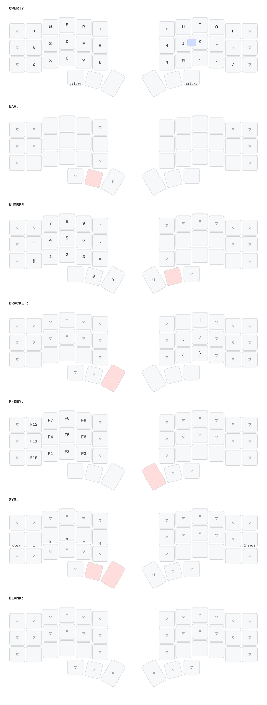

## Using `zmk` forks

Add the fork to `config/west.yml`, but make sure to set the `path` to something unique if needed (overrides `name`):

```yaml
  remotes:
    - name: SethMilliken
      url-base: https://github.com/SethMilliken
  projects:
    - name: zmk-seth-milliken
      remote: SethMilliken
      repo-path: zmk
      revision: zen-display-patches
      import: app/west.yml
```

Then in the build script use that `path` instead of `zmk`, e.g.:

```bash
west build \
  --build-dir "build/left" \
  --board "corneish_zen_left//zmk" \
  --source zmk-seth-milliken/app \
  -- \
  -DZMK_CONFIG=/app/config
```
